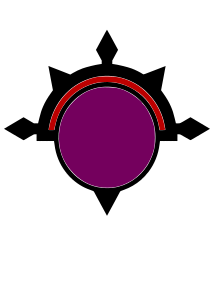
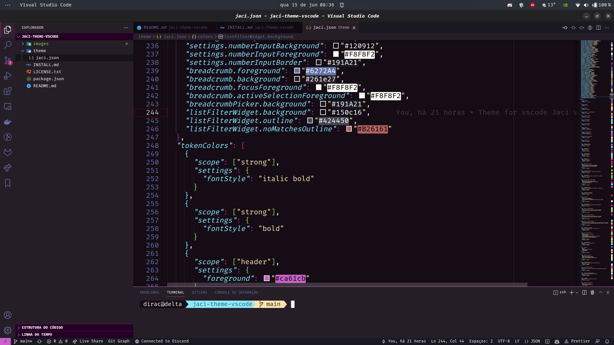

# jaci-theme-vscode

<h3 align="center">
  

jaci for <a href="https://vscode.rest/">vscode</a>

<h/3>

  <a href="https://github.com/fernandobortotti/jaci-theme-vscode" target="_blank">
    
     
    
  </a>

## Screenshots

Default

## Install

 Step by step to install the theme in vscode can be found <a href="https://github.com/fernandobortotti/jaci-theme-vscode/blob/main/INSTALL.md"> here
</a> 

## 🖖 Tks

## Theme history

Jaci (of Ya-cy or Ia-cy, from the Tupi, "mother of the animals"), in the Brazilian Mythology, is the moon goddess, protector of the animals, lovers, reproduction, plants, animals, lovers, night, moonlight, offerings and maidens. She avoided wars as she is goddess who prefers to observe before saying something.

Copyright &copy; 2022-present <a href="https://github.com/fernandobortotti" target="_blank">bortotti Org</a>

